# 100万亿Token告诉我们：AI模型的真实使用真相

> 这可能是迄今为止最大规模的 AI 模型使用行为研究。OpenRouter 联合 a16z 发布的这份报告，基于**100万亿Token**的真实使用数据，彻底颠覆了我们对大模型使用的认知。

## 写在前面

你以为大家都在用 AI 写代码、做总结吗？

**错了。**

这份来自 OpenRouter 的重磅报告告诉我们：**超过一半的开源模型使用量，竟然是角色扮演（Roleplay）！** 而且，开源模型的市场份额已经突破 30%，中国开源模型从不到 2% 飙升到近 30%。

让我们深入这份报告，看看 100 万亿 Token 背后的真实故事。

---

## 一、开源 vs 闭源：30% 的临界点

### 核心发现

**开源模型的市场份额已经稳定在约 30%**，形成了一个有趣的"动态平衡"：

| 模型类型 | 平均周占比 | 特点 |
|---------|----------|------|
| 闭源模型 (RoW) | ~70% | 可靠性高，企业级应用 |
| 开源模型 (RoW) | ~13.7% | 成本低，可定制 |
| 中国开源模型 | ~13.0% | 增长最快，迭代密集 |

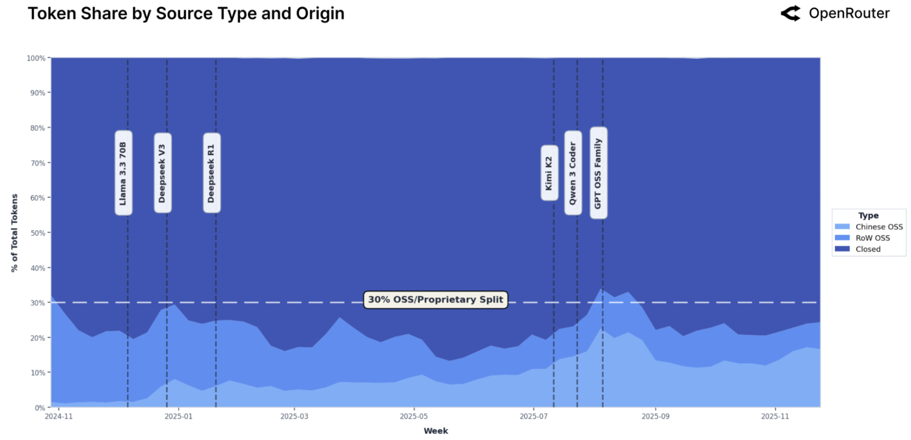

*Figure 1: 开源与闭源模型 Token 份额变化趋势（2024年11月 - 2025年11月）。浅蓝色代表开源模型（中国 vs 其他地区），深蓝色代表闭源模型。垂直虚线标记了关键开源模型的发布时间点。*

### 中国开源模型的逆袭

最令人瞩目的是中国开源模型的崛起：

- **2024年底**：周占比低至 1.2%
- **2025年末**：飙升至近 **30%**（部分周）

DeepSeek V3、DeepSeek R1、Qwen 系列、Kimi K2 等模型的连续发布，让中国成为全球开源 AI 的重要力量。

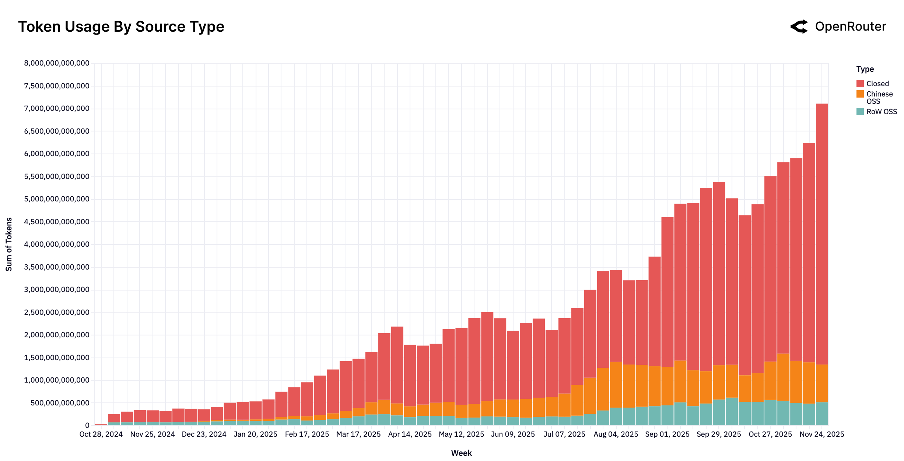

*Figure 2: 每周 Token 总量（按模型类型）。红色为闭源模型，橙色为中国开源模型，青色为其他地区开源模型。2025年中开始，中国开源模型份额显著增长。*

::: tip 关键洞察
这不是零和游戏。开源和闭源模型正在形成**互补关系**——闭源模型定义性能上限，开源模型提供成本效率和定制空间。
:::

---

## 二、谁是开源世界的王者？

### Top 10 开源模型作者

| 排名 | 模型作者 | 总Token量（万亿） |
|-----|---------|------------------|
| 1 | DeepSeek | 14.37 |
| 2 | Qwen（阿里） | 5.59 |
| 3 | Meta LLaMA | 3.96 |
| 4 | Mistral AI | 2.92 |
| 5 | OpenAI (OSS) | 1.65 |
| 6 | Minimax | 1.26 |
| 7 | Z-AI | 1.18 |
| 8 | TNGTech | 1.13 |
| 9 | MoonshotAI | 0.92 |
| 10 | Google | 0.82 |

### 从垄断到百花齐放

一年前，DeepSeek 几乎垄断开源市场（超过50%）。

如今呢？

**没有任何一个开源模型的份额超过 25%。** 市场从"一家独大"变成了"群雄逐鹿"。

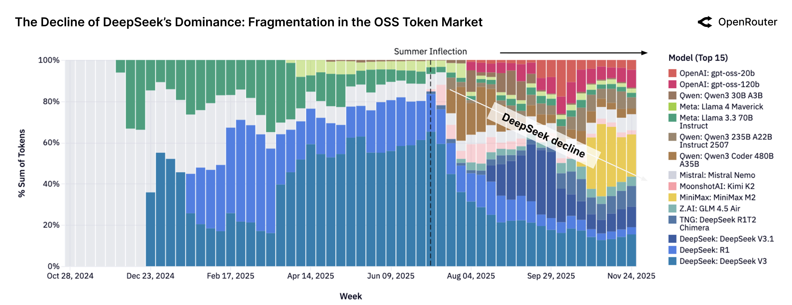

*Figure 3: Top 15 开源模型的周 Token 份额变化。2025年中的"夏季拐点"（Summer Inflection）标志着市场结构的根本性转变——从 DeepSeek 主导走向多元竞争。*

这意味着：
- 用户有更多选择
- 新模型可以快速获得市场份额
- 持续迭代是保持领先的唯一方式

---

## 三、中等模型的崛起：Medium is the New Small

### 模型尺寸分类

| 类别 | 参数量 | 当前趋势 |
|-----|-------|---------|
| Small | < 15B | 📉 下降到 12% |
| Medium | 15B - 70B | 📈 快速增长 |
| Large | > 70B | 📈 稳定在 50% |

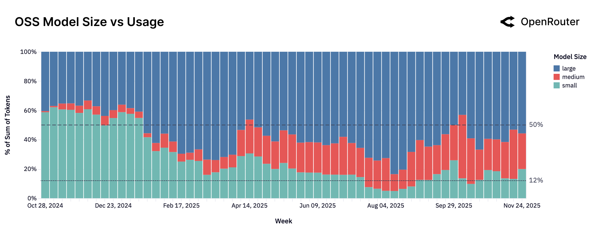

*Figure 4: 开源模型尺寸与使用量的关系。小型模型份额持续下降，中型和大型模型正在占据主导地位。*

### 为什么中等模型火了？

**Qwen2.5 Coder 32B** 的发布（2024年11月）实际上**创造了一个新市场**。

用户发现：中等尺寸模型在**能力和效率之间找到了甜蜜点**：
- 比小模型更聪明
- 比大模型更便宜、更快
- 足够应对大多数生产场景

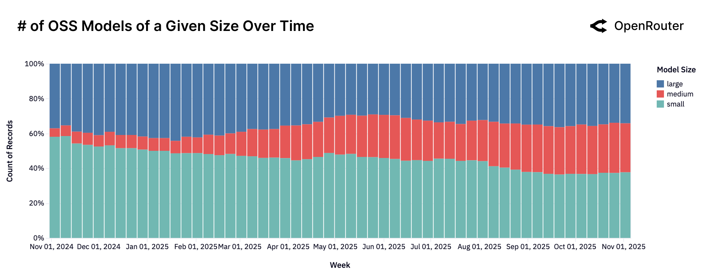

*Figure 5: 开源模型数量（按尺寸）随时间变化。虽然各尺寸模型数量都在增长，但使用量却向中大型模型倾斜。*

::: warning 趋势预警
小模型的时代可能正在终结。用户正在向两极分化：要么用中等模型求性价比，要么用最强大模型求极限能力。
:::

---

## 四、人们到底在用 AI 做什么？

这可能是整份报告最令人意外的部分。

### 开源模型使用分布

| 类别 | 占比 | 说明 |
|-----|------|------|
| **Roleplay（角色扮演）** | **~52%** | 最大类别！ |
| Programming（编程） | ~15-20% | 第二大类别 |
| Translation（翻译） | ~5% | 稳定需求 |
| Science（科学） | ~4% | 主要是AI相关问题 |
| 其他 | ~19% | 长尾分布 |

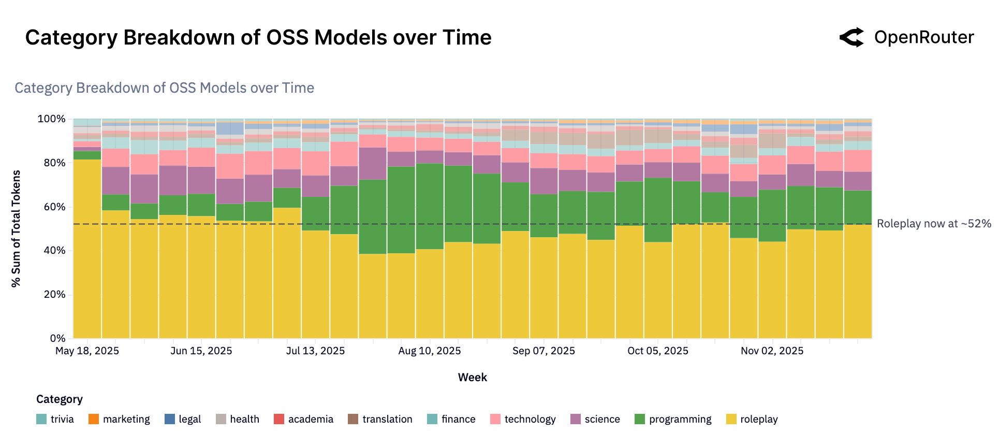

*Figure 6: 开源模型的使用类别分布随时间的变化。角色扮演（黄色区域）持续占据超过 50% 的份额，编程（绿色）为第二大类别。*

### 角色扮演为何如此火爆？

很多人以为 AI 主要用来：写代码、写邮件、做总结。

**现实是**：超过一半的开源模型使用量是**角色扮演和创意对话**！

原因很简单：

1. **开源模型限制更少**：可以进行更自由的创意表达
2. **场景丰富**：互动小说、游戏、虚拟角色、同人创作
3. **情感连接**：用户需要能记住上下文、有性格一致性的对话伙伴

### 中国开源模型的使用画像

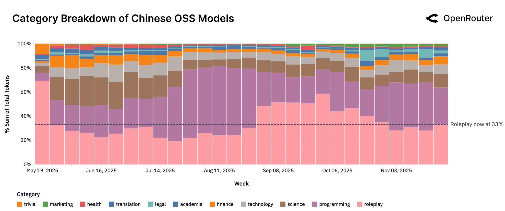

*Figure 7: 中国开源模型类别趋势。与整体开源生态不同，中国模型的编程和技术使用占比更高（合计约39%），角色扮演占比约33%。*

::: info 商业启示
这揭示了一个巨大的消费级AI市场机会：
- 互动叙事
- 游戏 NPC
- 虚拟伴侣
- 创作者驱动的虚拟角色
:::

### 编程任务的竞争格局

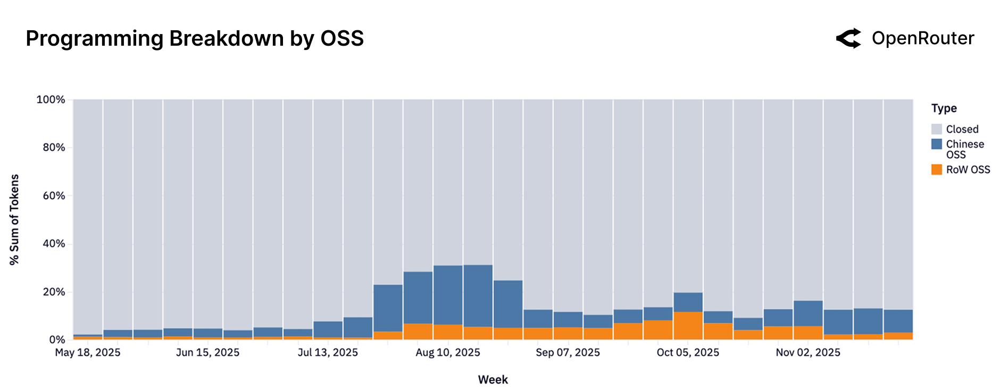

*Figure 8: 编程查询的模型来源分布。闭源模型（灰色）仍占主导，但开源模型份额在快速增长，中国开源与西方开源模型交替领先。*

### 角色扮演市场的变化

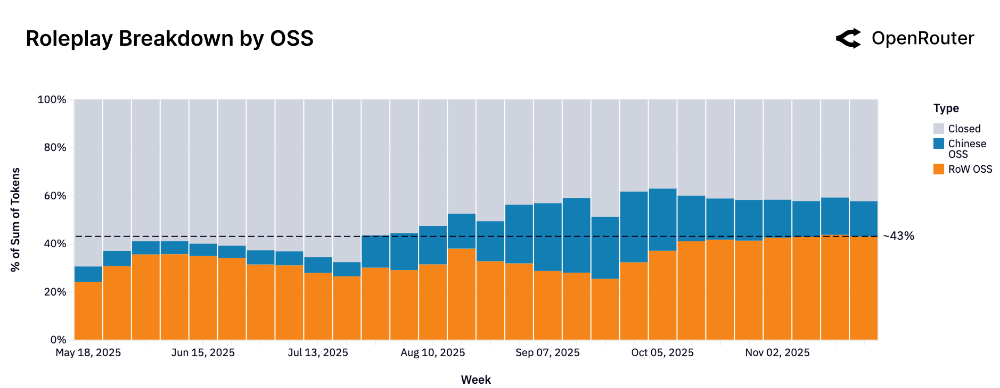

*Figure 9: 角色扮演查询的模型来源分布。2025年末，西方开源模型（橙色，43%）和闭源模型（灰色，42%）几乎平分秋色，中国开源模型也在增长。*

### 不同厂商的使用画像

| 厂商 | 主要用途 | 特点 |
|-----|---------|------|
| **Anthropic Claude** | 编程 + 技术 > 80% | 开发者的首选工具 |
| **Google Gemini** | 多元化分布 | 通用信息引擎 |
| **OpenAI** | 编程 + 技术 ~58% | 从科学转向编程 |
| **DeepSeek** | 角色扮演主导 | 消费者导向 |
| **Qwen** | 编程 40-60% | 技术开发者市场 |

---

## 五、Agent 时代来临：推理模型占据半壁江山

### 推理模型的崛起

从 2024 年 12 月 5 日 OpenAI 发布 o1 开始，AI 进入了"推理时代"：

- **2025年初**：推理模型占比几乎为零
- **2025年末**：**超过 50%**

这不是小修小补，这是**范式转变**。

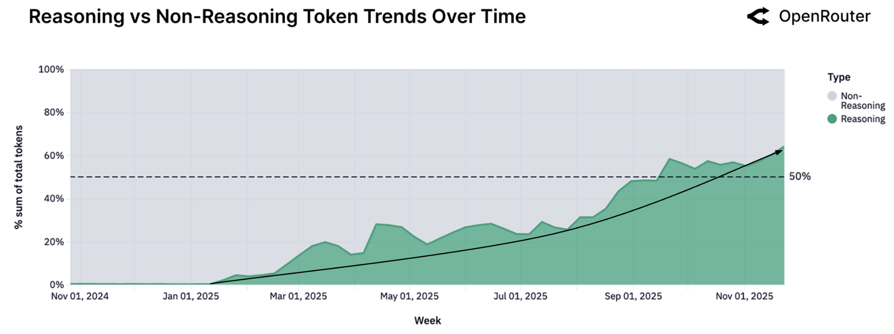

*Figure 10: 推理模型与非推理模型的 Token 份额变化。绿色区域代表推理模型，已突破 50% 的分界线，标志着这一历史性转折。*

### 谁在领跑推理模型？

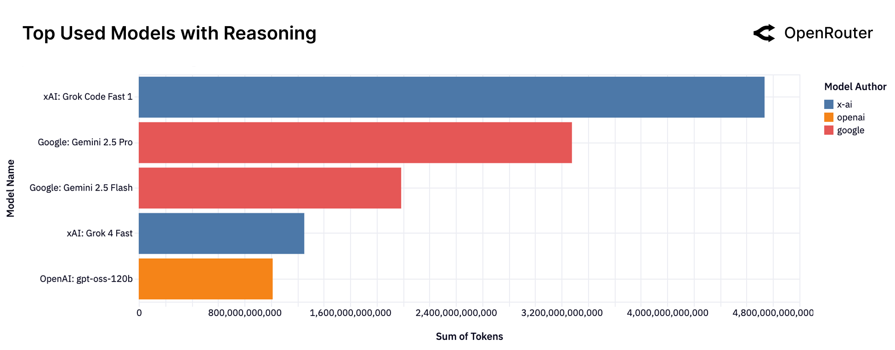

*Figure 11: Top 推理模型（按 Token 量）。xAI 的 Grok Code Fast 1 目前领先，Google 的 Gemini 2.5 Pro 和 Flash 紧随其后。*

### 工具调用的崛起

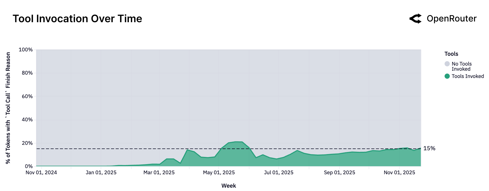

*Figure 12: 工具调用趋势。工具调用占比从 2024 年初的约 5% 增长到 2025 年末的约 15%，增长了 3 倍。*

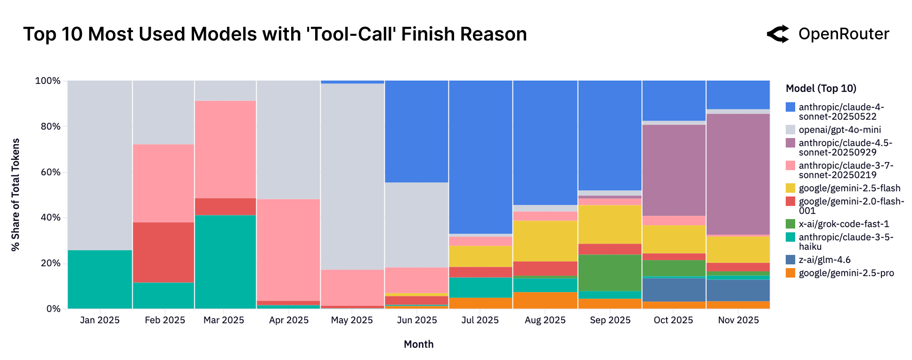

*Figure 13: 工具调用 Top 模型。Claude Sonnet 系列和 Gemini Flash 在工具调用方面表现突出。*

### 什么是 Agentic Inference？

传统 LLM 使用：一问一答，单轮交互。

Agentic 推理：
- 多步骤规划
- 工具调用
- 迭代优化
- 长上下文保持

### 关键指标变化

| 指标 | 2024年初 | 2025年末 | 变化 |
|-----|---------|---------|------|
| 平均 Prompt 长度 | ~1,500 tokens | ~6,000 tokens | **4倍增长** |
| 平均 Completion 长度 | ~150 tokens | ~400 tokens | **近3倍** |
| 工具调用占比 | ~5% | ~15% | **3倍增长** |

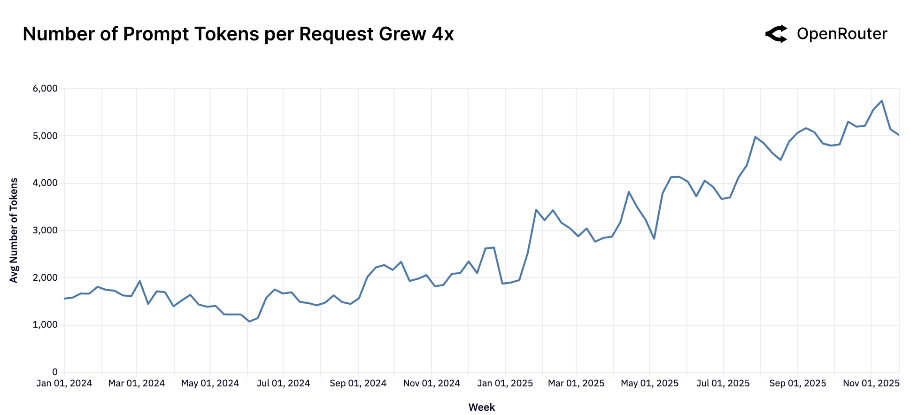

*Figure 14: Prompt Token 数量增长趋势。平均 Prompt 长度从约 1,500 增长到超过 6,000 tokens，增长近 4 倍。*

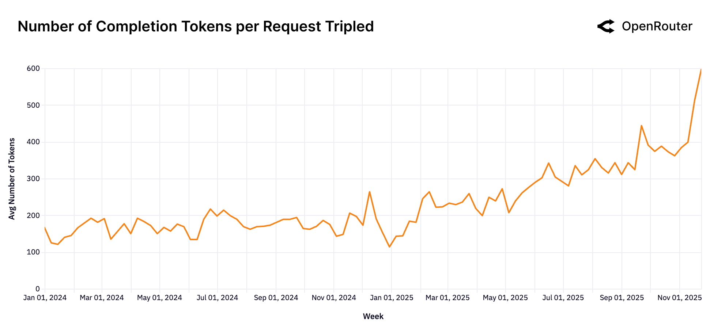

*Figure 15: Completion Token 数量增长趋势。输出长度从约 150 增长到约 400 tokens，主要由推理 token 贡献。*

### 编程驱动的复杂性增长

编程任务的 Prompt 长度是其他任务的 **3-4倍**，经常超过 **20,000 tokens**。

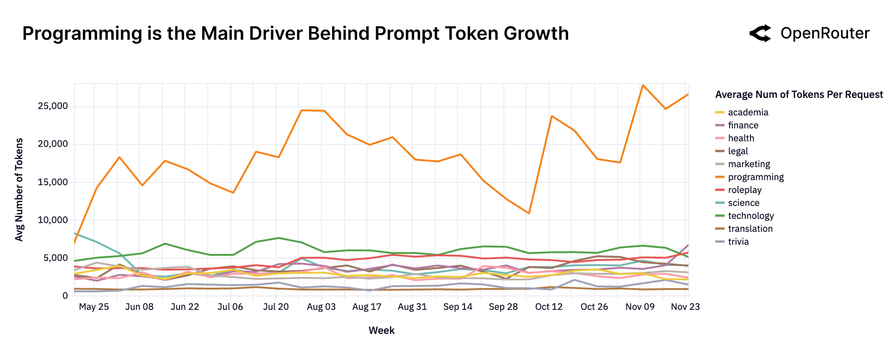

*Figure 16: 编程是 Prompt Token 增长的主要驱动力。编程任务（橙色线）的平均 Prompt 长度远超其他类别。*

这意味着：
- 开发者正在把整个代码库喂给 AI
- AI 正在从"代码补全"变成"系统架构师"
- Context window 的重要性超过以往

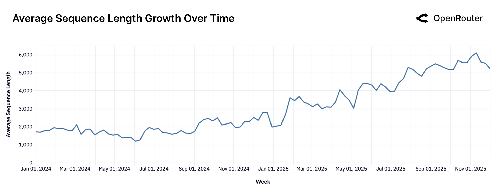

*Figure 17: 平均序列长度随时间变化。从 2023 年末的不到 2,000 tokens 增长到 2025 年末的超过 5,400 tokens。*

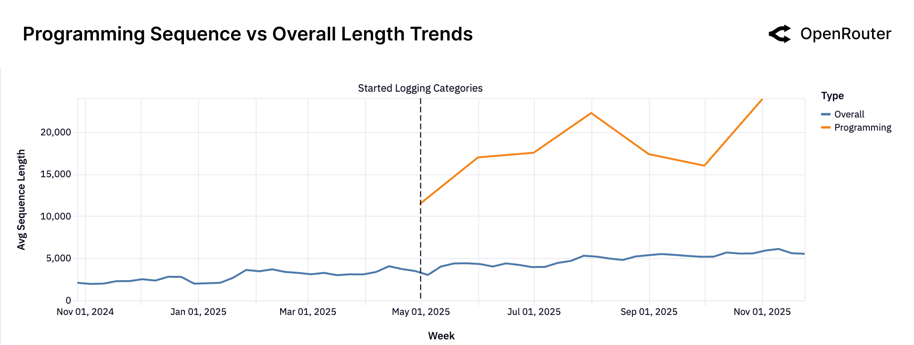

*Figure 18: 编程任务 vs 整体平均序列长度。编程任务的序列长度是整体平均的 3-4 倍，且增长更快。*

::: tip 预测
**Agentic 推理很快将占据大多数推理负载**——如果还没有的话。
:::

---

## 六、人们到底在用 LLM 做什么？全景视图

### 编程成为最大且增长最快的类别

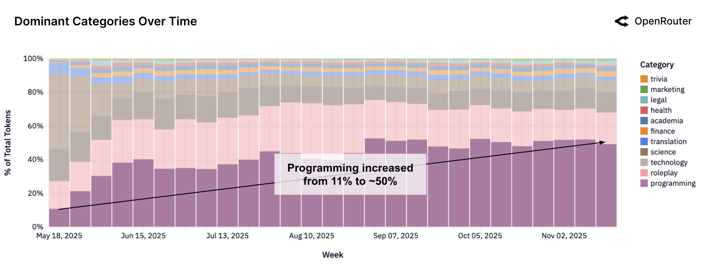

*Figure 19: 主要类别随时间变化。编程（绿色）从 2025 年初的约 11% 增长到近期的超过 50%，成为最大的单一类别。*

### Anthropic 主导编程市场

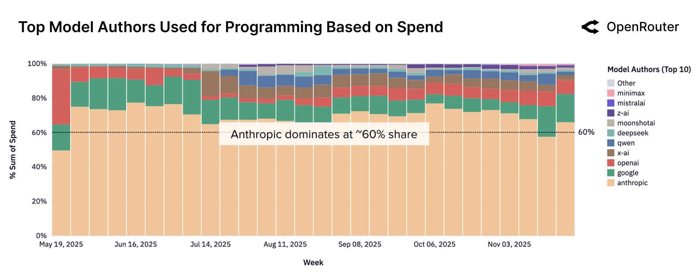

*Figure 20: 编程任务中各厂商的份额变化。Anthropic 的 Claude 系列持续主导，占据约 60% 的编程市场份额。*

**Anthropic Claude 占据编程市场 ~60% 份额**——这是一个惊人的数字。

但竞争正在加剧：
- OpenAI 从 ~2% 增长到 ~8%
- Google 稳定在 ~15%
- MiniMax、Z.AI、Qwen 快速增长

### 各类别的内部构成

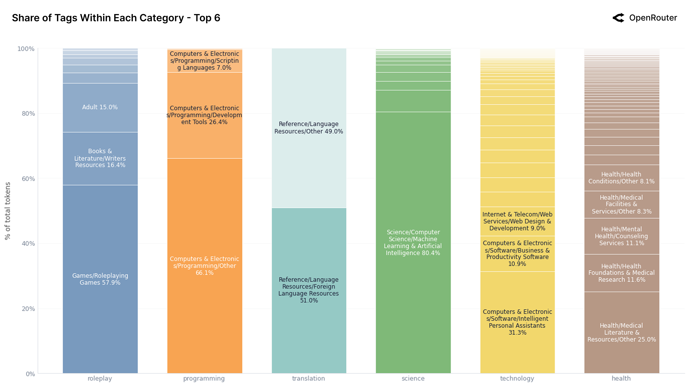

*Figure 21a: Top 6 类别的 Tag 构成。角色扮演中 58% 是游戏/角色扮演游戏，编程中 68% 是通用编程任务。*

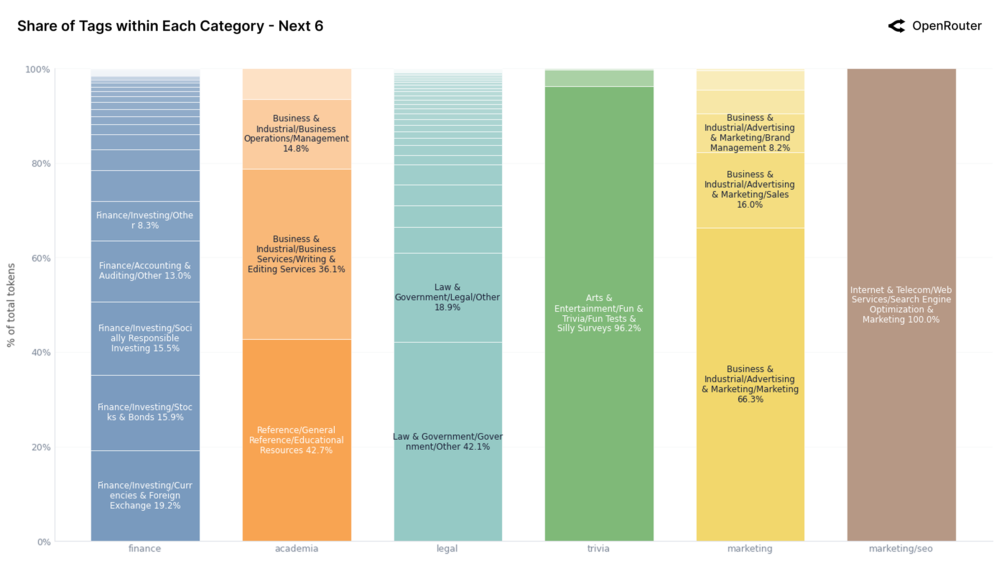

*Figure 21b: 次 6 类别的 Tag 构成。金融、学术、法律等长尾类别的内部结构更加分散。*

### 各厂商的使用画像详解

#### Anthropic Claude

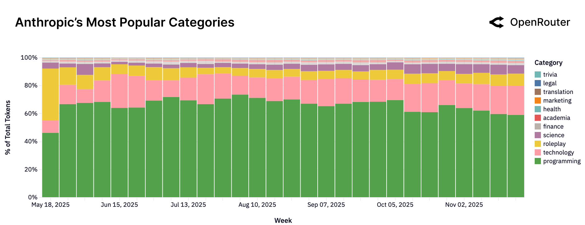

*Figure 22a: Anthropic Claude 的使用类别分布。编程 + 技术合计超过 80%，是典型的开发者工具定位。*

#### Google Gemini

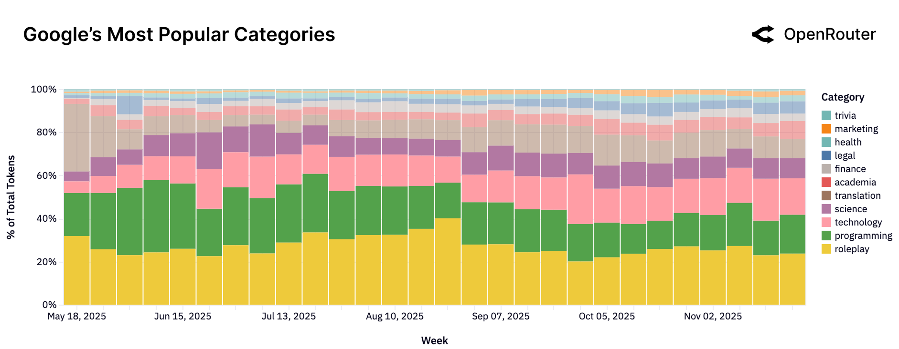

*Figure 22b: Google Gemini 的使用类别分布。分布更加多元化，科学、法律、翻译等类别占比更高。*

#### xAI Grok

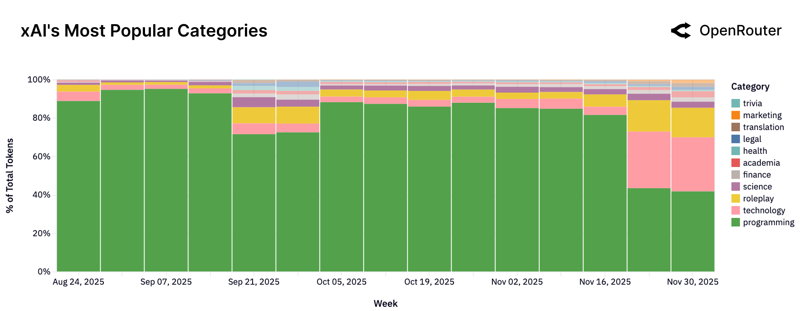

*Figure 22c: xAI Grok 的使用类别分布。大部分时间编程占比超过 80%，但 11 月末开始向其他类别扩展。*

#### OpenAI

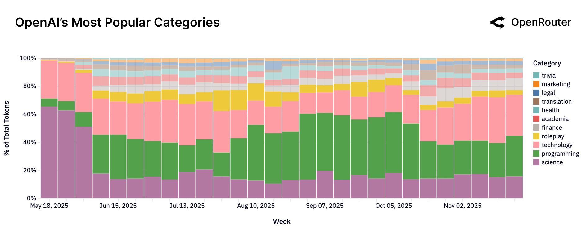

*Figure 23a: OpenAI 的使用类别分布。从早期的科学主导转向编程和技术主导，反映了产品定位的演变。*

#### DeepSeek

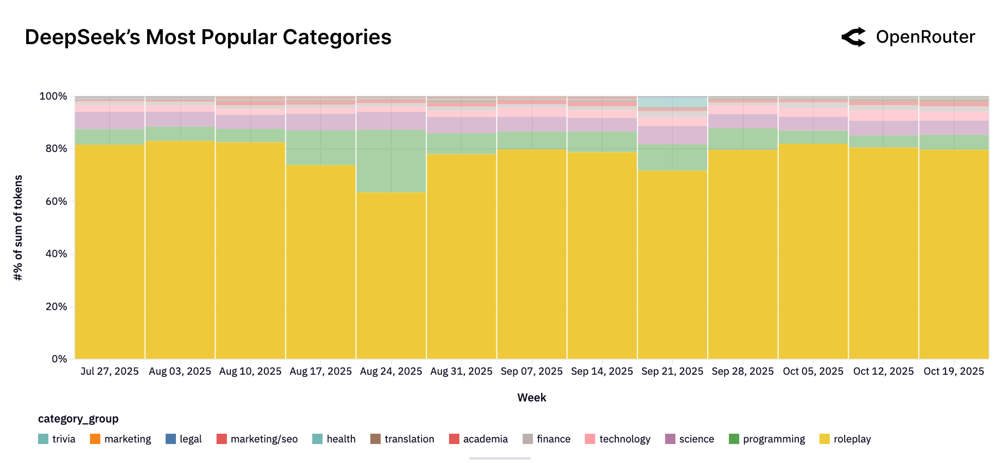

*Figure 23b: DeepSeek 的使用类别分布。角色扮演占据主导地位，但编程使用在逐步增长。*

#### Qwen

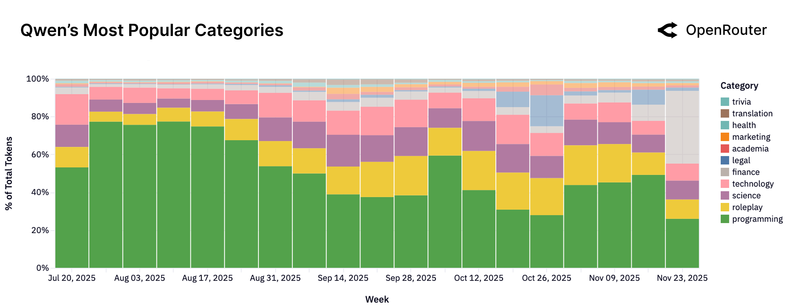

*Figure 23c: Qwen 的使用类别分布。编程占比 40-60%，是技术开发者的重要选择。*

---

## 七、全球视角：亚洲的崛起

### 区域分布变化

| 地区 | 早期占比 | 当前占比 | 趋势 |
|-----|---------|---------|------|
| North America | >50% | ~40-45% | 📉 下降 |
| Europe | ~15-20% | ~15-20% | ➡️ 稳定 |
| Asia | ~13% | **~31%** | 📈 翻倍+ |

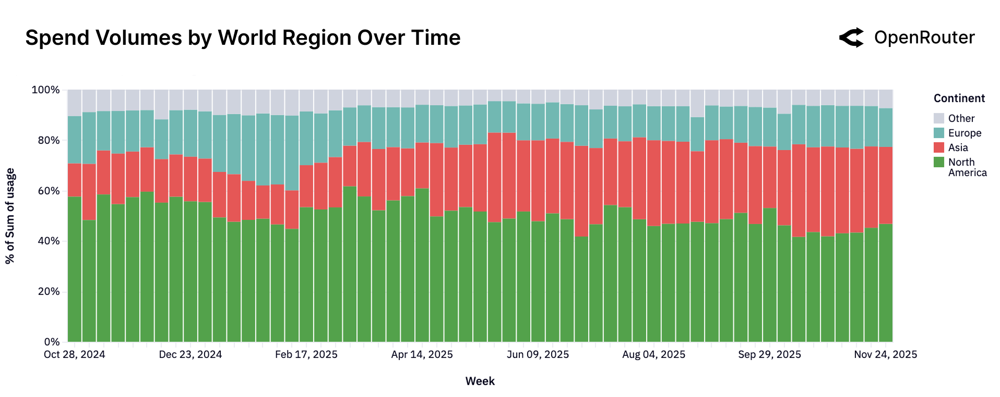

*Figure 24: 各大洲使用量份额的周级别变化。亚洲的增长趋势尤为显著，从 13% 翻倍至 31%。*

### 语言分布

| 语言 | Token 占比 |
|-----|-----------|
| English | 82.87% |
| Chinese (Simplified) | 4.95% |
| Russian | 2.47% |
| Spanish | 1.43% |
| Thai | 1.03% |
| Others | 7.25% |

::: info 全球化趋势
AI 模型必须**全球可用**——在语言、文化、合规等方面都要适应本地需求。下一阶段的竞争将取决于多语言能力和文化适应性。
:::

---

## 八、灰姑娘效应：用户留存的秘密

### 什么是"灰姑娘玻璃鞋"效应？

报告提出了一个精彩的比喻：

每个新模型发布时，都像是在"试穿玻璃鞋"——寻找那些**恰好被解决**的工作负载。

一旦找到完美匹配：
- 用户会深度嵌入工作流
- 切换成本急剧上升
- 形成**基础性用户群**（Foundational Cohort）

### 八个主要模型的留存曲线

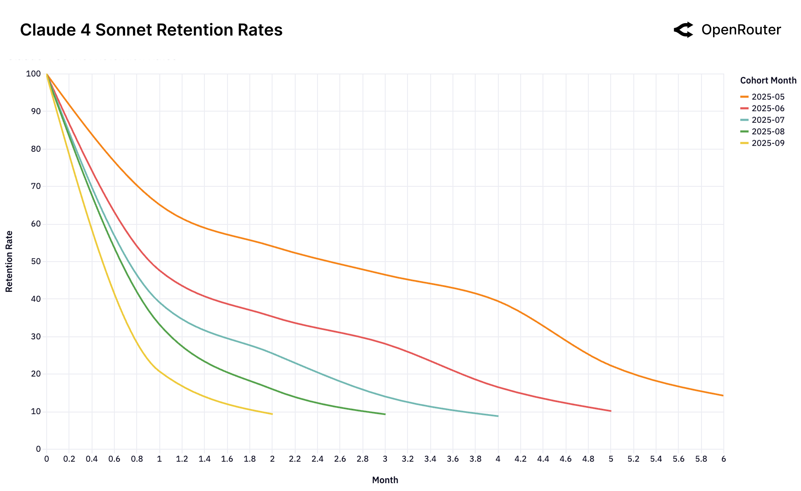

*Figure 25a: Claude 4 Sonnet 留存率。早期用户（5月群体）在 5 个月后仍保持约 40% 的留存率。*

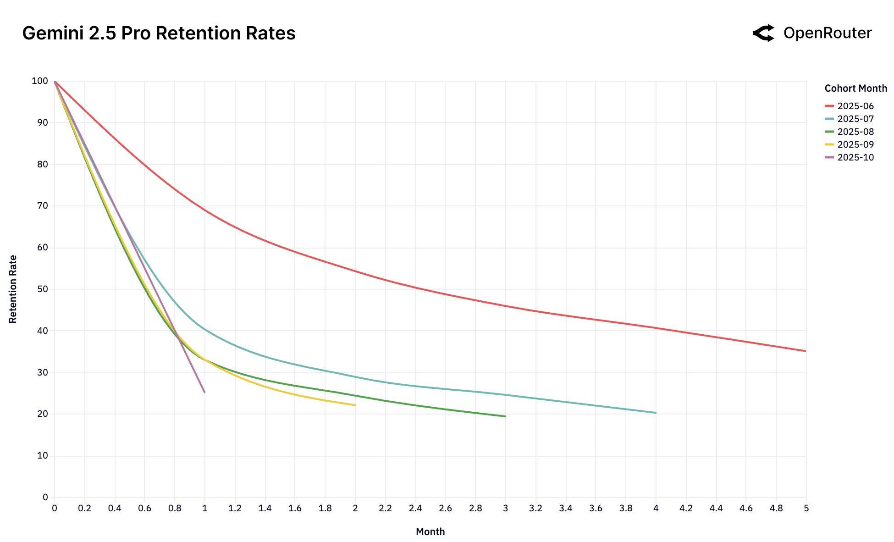

*Figure 25b: Gemini 2.5 Pro 留存率。6月群体表现出强劲的基础性用户特征。*

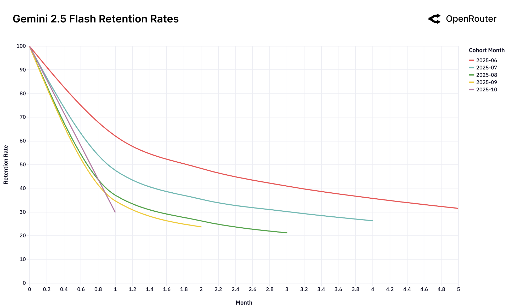

*Figure 25c: Gemini 2.5 Flash 留存率。各群体表现相似，缺乏明显的基础性用户群。*

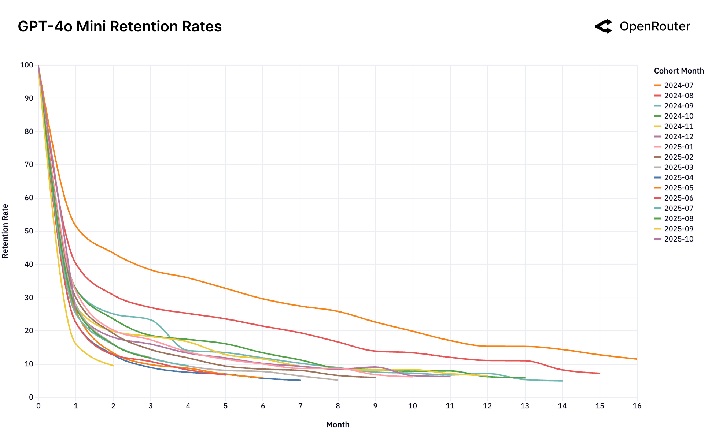

*Figure 25d: GPT-4o Mini 留存率。典型的"单次锁定"模式——首发群体极其稳定，后续群体全部流失。*

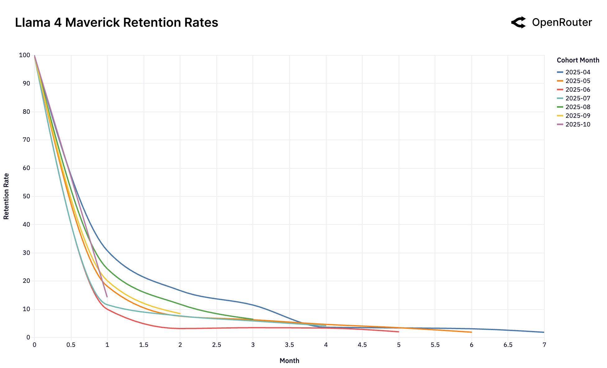

*Figure 25e: Llama 4 Maverick 留存率。典型的"无锁定"模式——所有群体表现相似且较差。*

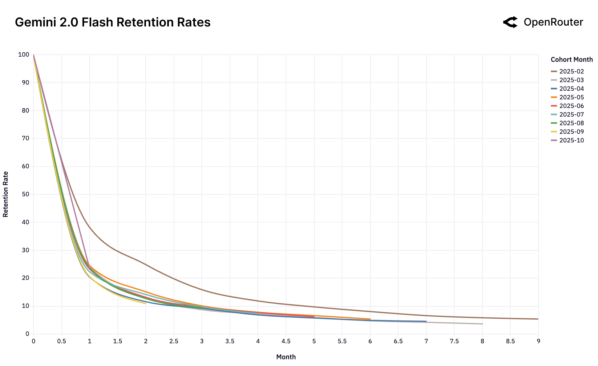

*Figure 25f: Gemini 2.0 Flash 留存率。同样是"无锁定"模式，未能建立基础性用户群。*

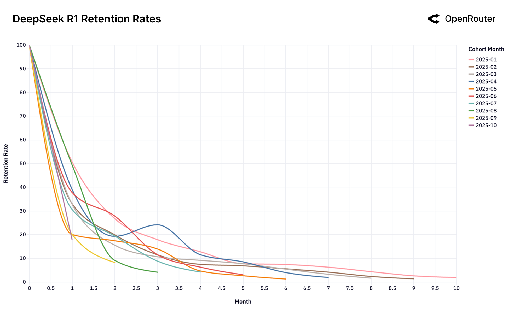

*Figure 25g: DeepSeek R1 留存率。展示"回旋镖效应"——用户流失后又回来。*

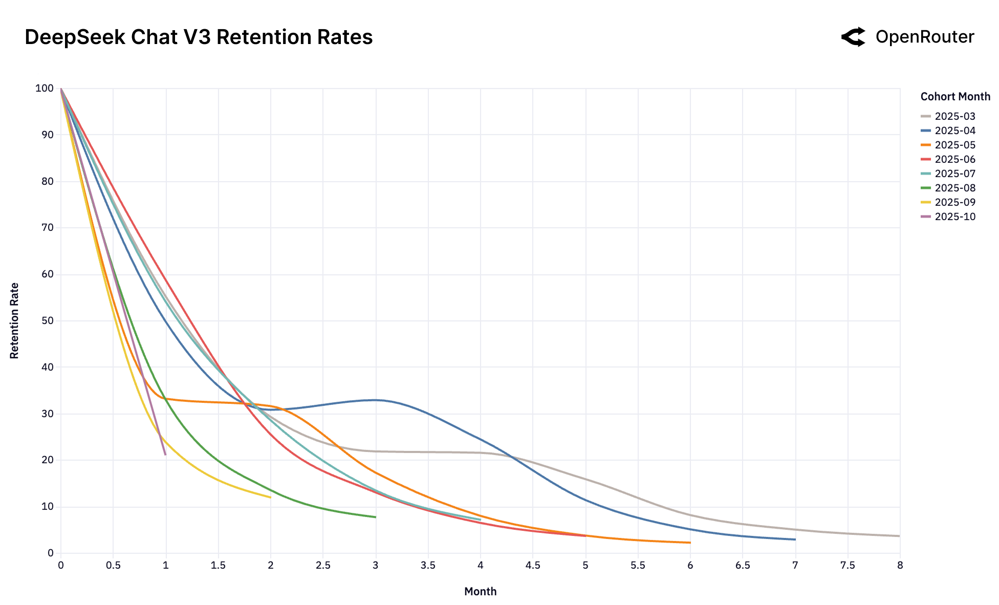

*Figure 25h: DeepSeek Chat V3-0324 留存率。同样展示复杂的回旋镖效应。*

### 四种留存模式

| 模式 | 代表模型 | 特点 |
|-----|---------|------|
| **强基础群** | Claude 4 Sonnet, Gemini 2.5 Pro | 早期用户留存 40%+，5个月后 |
| **单次锁定** | GPT-4o Mini | 首发群体极其稳定，后续群体全部流失 |
| **无锁定** | Gemini 2.0 Flash, Llama 4 | 所有群体表现相似且较差 |
| **回旋镖** | DeepSeek R1 | 用户流失后又回来 |

### 对创业者的启示

**窗口期极短**：你的模型被认为是"前沿"的那一刻，就是锁定基础用户的唯一机会。

错过了？别指望后来的用户能弥补。

---

## 九、成本与使用量：价格不是一切

### 市场四象限

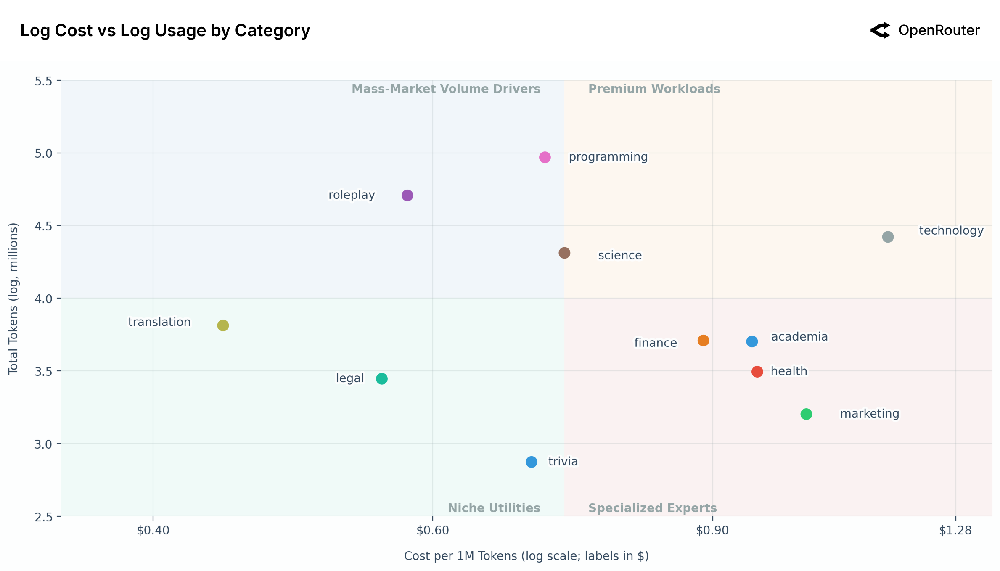

*Figure 26: 成本 vs 使用量（按类别，对数坐标）。编程和角色扮演是两大"大众市场驱动力"，技术类是"高价高量"的溢价类别。*

| 象限 | 特点 | 代表类别 |
|-----|------|---------|
| **Mass-Market Volume** (左上) | 低价高量 | 编程、角色扮演、科学 |
| **Premium Workloads** (右上) | 高价高量 | 技术 |
| **Specialized Experts** (右下) | 高价低量 | 金融、学术、健康、营销 |
| **Niche Utilities** (左下) | 低价低量 | 翻译、法律、问答 |

### 模型市场图

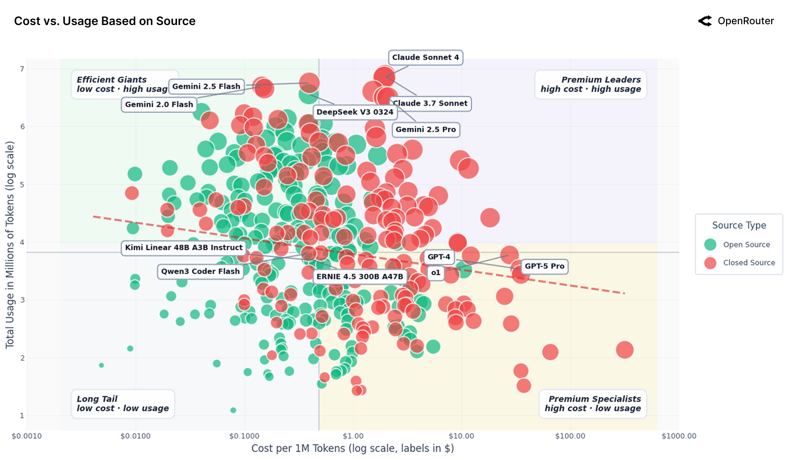

*Figure 27: 开源 vs 闭源模型的成本-使用量图（对数坐标）。闭源模型（红色）集中在高成本高使用量区域，开源模型（绿色）主导低成本高容量区域。*

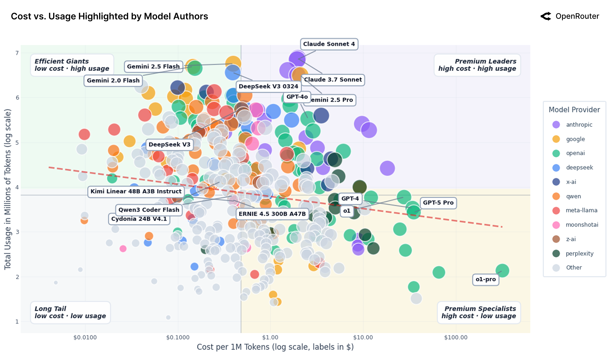

*Figure 28: AI 模型市场图（按厂商着色）。四个象限清晰呈现：Efficient Giants（低价高量）、Premium Leaders（高价高量）、Long Tail（低价低量）、Premium Specialists（高价低量）。*

### 模型分层示例

| 分层 | 模型 | 价格/1M Tokens | 使用量(log) |
|-----|------|---------------|------------|
| Efficient Giants | Gemini 2.0 Flash | $0.15 | 6.68 |
| Efficient Giants | DeepSeek V3-0324 | $0.39 | 6.55 |
| Premium Leaders | Claude 3.7 Sonnet | $1.96 | 6.87 |
| Premium Leaders | Claude Sonnet 4 | $1.94 | 6.84 |
| Premium Specialists | GPT-4 | $34.07 | 3.53 |
| Premium Specialists | GPT-5 Pro | $34.97 | 3.42 |

### 关键发现

**价格弹性极低**：价格下降 10%，使用量仅增加 0.5-0.7%。

这说明什么？

1. **质量胜过价格**：用户愿意为更好的模型付出溢价
2. **便宜不够**：模型还需要足够好、足够可靠
3. **市场尚未商品化**：差异化仍然有价值

### Jevons 悖论的证据

当某些模型变得非常便宜时，用户反而用得更多：
- 跑更长的上下文
- 做更多的迭代
- 尝试更多的任务

结果是：**总消费量反而上升**。

---

## 十、附录：类别子组成详解

### 角色扮演的内部构成

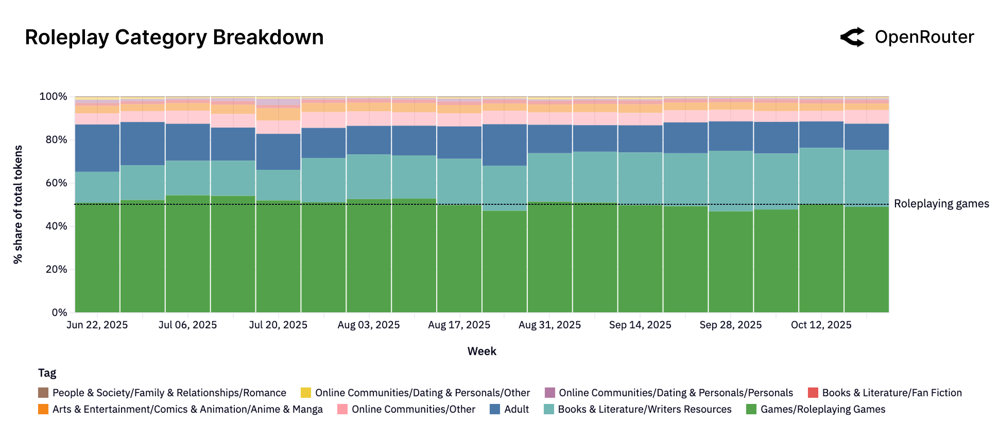

*Figure 29a: 角色扮演类别的子构成。游戏/角色扮演游戏占 58%，写作资源和成人内容各占约 15%。*

### 编程的内部构成

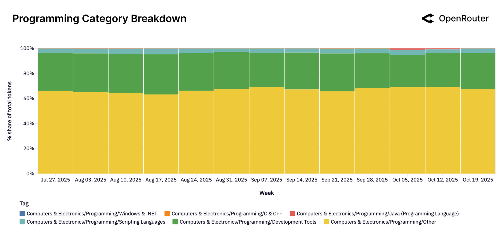

*Figure 29b: 编程类别的子构成。通用编程任务占主导，开发工具次之，各编程语言（.NET、C++、Java 等）各占小部分。*

### 技术的内部构成

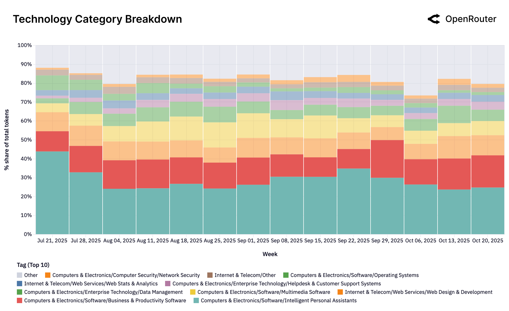

*Figure 29c: 技术类别的子构成。智能助手和生产力软件合计占 65%，IT 支持和消费电子查询次之。*

---

## 十一、总结与展望

### 六大核心发现

1. **多模型生态系统**：没有单一模型能主导所有场景
2. **使用多样性超出想象**：角色扮演 > 编程 > 其他
3. **Agent 时代来临**：推理模型占比超过 50%
4. **全球化加速**：亚洲份额翻倍
5. **价格不是决定因素**：质量和能力更重要
6. **灰姑娘效应**：早期锁定决定长期成功

### 对不同角色的建议

#### 对开发者

- **多模型策略**：不要押注单一模型
- **关注 Agent 框架**：单轮问答正在过时
- **编程助手将无处不在**：准备好更长的上下文

#### 对模型厂商

- **持续迭代是唯一出路**：停滞就意味着失去份额
- **找到你的"玻璃鞋"**：专注解决特定工作负载
- **全球化思维**：英语之外还有广阔市场

#### 对投资者

- **关注留存曲线**：而非增长曲线
- **基础性用户群**：是护城河的真正来源
- **开源不是威胁**：而是推动创新的动力

### 最后的思考

o1 的发布不是竞争的终结，而是设计空间的扩展。

AI 行业正在从：
- **单一赌注** → **系统思维**
- **直觉驱动** → **数据驱动**
- **跑分竞赛** → **实际使用分析**

如果过去一年证明了 Agentic 推理在规模上可行，那么下一年将聚焦于**运营卓越**：
- 衡量真实任务完成率
- 减少分布偏移下的方差
- 将模型行为与生产级工作负载的实际需求对齐

---

## 数据来源

本文基于 OpenRouter 与 a16z 联合发布的研究报告 *"State of AI: An Empirical 100 Trillion Token Study with OpenRouter"*（2025年12月）。

- 报告作者：Malika Aubakirova, Alex Atallah, Chris Clark, Justin Summerville, Anjney Midha
- 数据范围：2024年11月 - 2025年11月
- Token 总量：100+ 万亿
- 平台：OpenRouter（支持 300+ 模型，60+ 提供商）

::: tip 获取原始报告
- **报告原文**：[State of AI - OpenRouter](https://openrouter.ai/state-of-ai)
- 原始 PDF 报告包含所有图表和详细数据，建议感兴趣的读者下载阅读完整版本。
:::

---

*你对这份报告的发现有什么看法？欢迎在评论区分享你的观点。*
